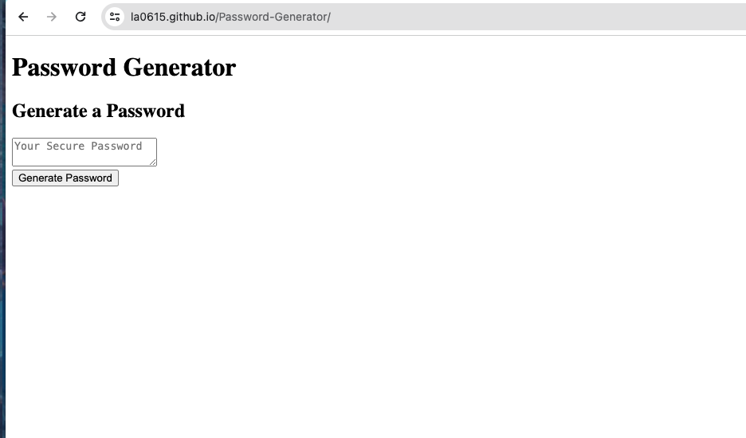

# Password Generator


## Description


This project uses javascript to create a password generator. The uswer will select choices for character length, uppercase letters, lowercase letters, special characters, and/or numbers. The user will click the GENERATE button and their pssword should appear in the textbox based on their input choices. 

- What was your motivation?
This project was created to practice what I learned during the javascript classes. 

- Why did you build this project? In order to understand functions, for loops, and conditional statements, this project was created so that I could practice these new skills. 

- What problem does it solve? This allows a user to select certain criteria for a password that will be generated for them upon request. 

- What did you learn? I learned that syntax is important in javascript and that variables must have a specific name in order to perform the required action. 

## Table of Contents
M/A

## Installation

N/A


To add a screenshot, create an `assets/images` folder in your repository and upload your screenshot to it. Then, using the relative filepath, add it to your README using the following syntax:


   ```md
   
   ```

